英语生词：

```
right before： immediately before
```


DOC: B+Tree basics

A B+Tree is a data structure for looking up arbitrary (currently allowing unsigned long, u32, u64 and 2 * u64) keys into pointers. The data structure is described at https://en.wikipedia.org/wiki/B-tree, we currently do not use binary search to find the key on lookups.

Each B+Tree consists of a head, that contains bookkeeping information and a variable number (starting with zero) nodes. Each node contains the keys and pointers to sub-nodes, or, for leaf nodes, the keys and values for the tree entries.

Each node in this implementation has the following layout:

```
 [key1, key2, ..., keyN] [val1, val2, ..., valN]
```

Each key here is an array of unsigned longs, `geo->no_longs` in total. The number of keys and values (N) is geo->no_pairs.


see http://programming.kicks-ass.net/kernel-patches/vma_lookup/btree.patch

A relatively simple B+Tree implementation.  I have written it as a learning exercise to understand how B+Trees work.  Turned out to be useful as well.

B+Trees can be used similar to Linux radix trees (which don't have anything in common with textbook radix trees, beware).  Prerequisite for them working well is that access to a random tree node is much faster than a large number of operations within each node.

Disks have fulfilled the prerequisite for a long time.  More recently DRAM has gained similar properties, as memory access times, when measured in cpu cycles, have increased.  Cacheline sizes have increased as well, which also helps B+Trees.

Compared to radix trees, B+Trees are more efficient when dealing with a **sparsely populated address space**.  Between 25% and 50% of the memory is occupied with valid pointers.  When densely populated, radix trees contain ~98% pointers - hard to beat.  Very sparse radix trees contain only ~2% pointers.

This particular implementation stores pointers identified by a long value. Storing NULL pointers is illegal, lookup will return NULL when no entry was found.

（，。。特点：1、最小值在右边，而不是在左边  2、节点上所有已使用的槽位在左边，未使用的值为NULL；）A tricks was used that is not commonly found in textbooks.  The lowest values are to the right, not to the left.  All used slots within a node are on the left, all unused slots contain NUL values.  Most operations simply loop once over all slots and terminate on the first NUL.


### 1、结构体

btree_head：b树头部

- node: the first node in the tree
- mempool: mempool used for node allocations
- height: current of the tree


btree_geo：（树的几何大小）btree geometry

- keylen：单个key的以（unsigned long）为单位的长度（支持32、64、128）
- no_pairs：key-val对的个数（key的个数）
- no_longs：（unsigned  long）key的个数

### 2、工具宏

BUG_ON：

- 如果不开启调试特性，直接跳过。
- 否则，cond为**真**，则assert失败。

```c
#ifdef NDEBUG
#define BUG_ON(cond) do { if (cond) {} } while (0)
#else
#define BUG_ON(cond) assert(!(cond))
#endif
```


### 3、API

#### btree_lookup 

- 如果树的高度为0，返NULL
- 。。。

```
btree_lookup：
	Ds：（在b树中查找一个key）look up a key in the btree
	Para：
        @head: the btree to look in
        @geo: the btree geometry
        @key: the key to look up
    Ret：
       1、如果查找到，返回key对应的val
       2、未找到，返NULL
```


#### btree_insert：

- 调试判断 val不为空
- 返回 ，调用 `btree_insert_level `的结果（level为1）

```
btree_insert 
  Ds：（插入一个项到b树中）insert an entry into the btree
  Para：
    @head: the btree to add to
    @geo: the btree geometry
    @key: the key to add (must not already be present)
    @val: the value to add (must not be %NULL)
    @gfp: allocation flags for node allocations
 Ret：
  1、returns 0 if the item could be added 
  2、or an error code if it failed (may fail due to memory pressure).
     -ENOMEM：内存分配失败
```

btree_insert_level

- 如果b树高度 小于 @level：
  - （func：b树高度增加，头结点移到下一层）
- flag：retry
- 获取（func：返回@key所在的叶子节点）
- 获取（func：返回@key在节点的区间下标。）
- 获取（func：返回@节点的实际key-val数量）
- 【调用约束】（2个相同的key不能出现） two identical keys are not allowed
  - BUG调试：（区间下标）**不是右边界**，且 @key 等于 @节点的区间下标。
- 如果：实际kv数量  == 节点最大kv数量
  - 说明，叶子节点满了，需要先**分裂**再插入。（need to split node）
  - 【🤢🤢🤢】
  - 如果：key-val实际数量 是 奇数：
    - 将 旧的（叶子节点）的最后一个key-val进行移位。
  - 【goto】flag：retry（目的：节点完成分裂，需要重新查找插入的叶子节点，再插入。）
- BUG调试：（走到这里）叶子节点个数 不能 大于等于 **节点最大kv数量**
- （移动key-val，得到空闲位置，插入@key）shift and insert
  - 将 叶子节点的[最右边 ->  区间下标] key-val，向后移动一位。
  - 将@key-@val，插入到 区间下标的位置中。


```
  Ds：【递归函数】
  Para：
    【upper】：同上，5个参数，上层API传入。
    level：插入的key，在树中的高度。
 Ret：
    【upper】：同上
```

btree_grow

- 从内存池分配新节点
- 如何头结点不为NULL：
  - 获取头结点最后一个key的下标
  - 将最后一个key，设置到（新节点）的第1对的key
  - 设置到（新节点）的第1对的val，为头节点指针。
- 修改@b树头部为（新节点），高度++
- 返回 0

```
btree_grow：
  Ds：b树高度增加，头结点移到下一层
  Ret：
     -ENOMEM：失败
     0：成功
```

getfill：返回@b树节点的 @start为起始下标，@b树几何的key-val数量为终止，的第一个为NULL的下标（全满则是越界的下标，不存在的后一个）

getpos：返回@key在节点的区间下标。

- 遍历@节点的kv对数量，如果节点的key  小于等于  @key  则返回当前下标。
- Note：边界情况，如下。

find_level：

- （当前节点）为树的头部节点
- 遍历b树高度 到 @level：
  - （从大到小）遍历节点所有的key-val对：
    - 如果（当前key） 小于等于 @key， 则@key位于[前一个key, 当前key] 二者之间，break；
      - Note：边界情况，下标为0，则@key比节点的最大key要大；**下标为（kv对个数） 或者  下标超过 （kv对实际个数），则@key比节点的最小key要小**。
  - 如果：@key比节点的最小key要小
    - （，最右边的key太大了，更新）right-most key is too large, update it； FIXME: If the right-most key on higher levels is always zero, this wouldn't be necessary.
    - 【？？？】为什么
    - 将节点的最右边的key，设置为 @key
      - BUG调试： 下标 i 不能小于0；==》这表示在节点只有一个key情况下，@key不能更小【？？？】
  - （当前节点）更新为@key右边的节点的val（子节点）
- BUG调试：（当前节点）不为NULL
  - 【？？？】
- 返回 （当前节点）

```
find_level：
  Ds：locate the correct leaf node in the btree
  Para：
    head：
    geo：
    key：
    level： 为1时，是叶子节点。 为2时是上一层节点，以此类推
  Ret：返回key所在的叶子节点
  

4 -> @level: 2
        +---+  4 -> @level: 1
+--+--+ | 4 | +--+--+
   |    +-+-+    |
   |      |      |
   |      v      |
   v    +-+-+    |
+-----+ | 3 |    |
   |    +-+-+    |
   |      |      |
   |      |      |
   v    +-v-+    v
        | 2 | +-----+
        +-+-+    |
          |      |
          |      |
        +-v-+    v
        | 1 |   leaf
        +---+


```





#### btree_remove：

```
btree_remove 
  Ds：（删除b树中的一个key-val项）remove an entry from the btree
  Para：
    @head: the btree to update
    @geo: the btree geometry
    @key: the key to remove
 Ret：
    1、returns the removed entry（val值）,
    2、or %NULL if the key could not be found.
```

btree_remove_level：

- 。。。【？？？】
- 获取（func：返回@key所在的叶子节点）
- 获取（func：返回@key在节点的区间下标。）
- 获取（func：返回@节点的实际key-val数量）
- 如果 @level是1，且叶子节点的区间下标 与 @key不上同一个值：
  - 返回 NULL（说明key没有找到，不存在）
- 获取key的val（目的：返回值）
- （删除并移位） remove and shift：。。。
- 当前key-val实际个数 = key-val实际个数 -1
- 如果： （当前key-val实际个数 ） 小于 floor( 节点key-val个数的一半)：
  - 如果：@level 小于 树的高度
    - 进行（func： 对B树进行重均衡）
  - 否则如果：（叶子节点）（当前key-val实际个数 ） 等于 1：
    - （func：btree_shrink）【？？？： 为啥这种情况下，要将头节点，更换掉？ 为什么能断定头节点只有1个key？】

```
btree_remove_level：
  Ds： 【间接-递归函数】
  Para：
    【upper】：同上
    level： 1表示在叶子节点删除，2表示上一层，以此类推。
```

rebalance：

- 如果 @fill 为 0：
  - //  （，因为我们不从邻节点 偷取 key-val，这种情况是有可能发生的； ）Because we don't steal entries from a neighbour, this case can happen.  Parent node contains a single child, this node, so merging with a sibling never happens.
  - （func：btree_remove_level，递归调用，@level + 1）目的：叶子节点的最后一个key已经删除了，则中间节点若是存在这个key，也需要删除掉。
  - 释放叶子节点内存。
  - 返回
- 【🤢🤢🤢】（merge合并左右节点）
- // （，不做的原因： 属性的改变；以及不变之处。）We could also try to steal one entry from the left or right neighbor.  By not doing so we changed the invariant from "**all nodes are at least half full**" to "**no two neighboring nodes can be merged**".  Which means that the average fill of all nodes is still half or better.

```
rebalance：
   Ds： 对B树进行重均衡
   Para：
     head：
     geo：
     key：
     level：
     child：重均衡的节点，站在上一层的角度看，是子节点。
     fill：@child的key个数
   Ret：void
```

merge

- （移动右节点的所有key，到左节点）Move all keys to the left
- （交换父节点的左右子节点指针（val））Exchange left and right child in parent
- （在父节点中移除左边的字节的，实际上是右边的）Remove left (formerly right) child from parent
- 释放右节点的内存

```
merge：
  Ds： 合并2个叶子节点
  Para：
    head：
    geo：
    level：
    left：
    lfill：
    right：
    rfill：
    parent：
    lpos：
 Ret：void
```


#### btree_last：

- 当前节点 为 起始节点
- 如果树的高度为0，返NULL
- 遍历b树的（中间节点的）高度：
  - 获取当前节点的第1项val（最大值），成为（当前节点）
- （当前节点）此时是叶子节点，获取其第1项的key，copy 到 @key
- 返回 第1项的val

```
btree_last：
	Ds： （获取b树中的最后一项的val）get last entry in btree
	Para：
        @head: btree head
        @geo: btree geometry
        @key: 【out】last key
    Ret：
        1、the last entry in the btree, and sets @key to the key of that entry; 
        2、NULL if the tree is empty, in that case key is not changed.
```


#### btree_get_prev：

- // Usually this function is quite similar to normal lookup.  But the key of a parent node may be smaller than the smallest key of all its siblings. In such a case we cannot just return NULL, as we have only proven that no key smaller than `__key`, but larger than this parent key exists. So we set `__key` to the parent key and retry.  We have to use the smallest such parent key, which is the last parent key we encountered.
- 【🤢🤢🤢】

```
btree_get_prev 
  Ds: （获取最近的后一个key-val项）get previous entry
  Para:
      @head: btree head
      @geo: btree geometry
      @key: pointer to key
  Ret: 
    1、The function returns the next item right before the value pointed to by @key, and updates @key with its key, 
    2、or returns %NULL when there is no entry with a key smaller than the given key.

```


### 4、内部工具函数

bkey：返会b树节点中第（n）个key的指针

- @node：b树节点
- @n：key的下标
- 从b树的几何中获取key的单位长度， 单位长度 x 下标 = n-th节点的起始下标，数组取值并返回。

bval：返回b树节点中第（n）个val，val是（void *）指针

- @node：b树节点
- @n：val的下标
- 从b树的几何中获取key的（unsigned long）的个数为起始点，加上n的下标，访问节点数组。（unsigned long） ==> （void *）

setkey：设置b树节点中第（n）个key的值

- 。。。

setval：设置b树节点中第（n）个val的值

- 。。。

clearpair：设置b树节点中第（n）个key-val 对的值为0

- 。。。


#### 4.2 longxxx类工具

longcmp

```
longcmp：
  Ds：从0开始往后进行整数比较，比较第一个不同的大小情况
  Para：
    l1；（unsigned long）数组
    l2：同上
    n：数组长度（约束：二者等长）
  Ret：
    -1：第一个不同的，l1更小
    1：第一个不同的，l1更大
    0：无不同，二者相同
```


