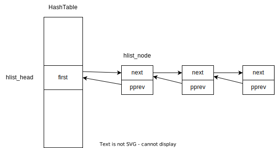

概念记录：

- loop cursor（循环游标）


1、头文件

条件宏：（，黄金比例质数不再是质数（之前的质数实际上对于哈希很差），但是其名字保留下来了。）The "GOLDEN_RATIO_PRIME" is used in `ifs/btrfs/brtfs_inode.h` and `fs/inode.c`.  It's not actually prime any more (the previous primes were actively bad for hashing), but the name remains.

- #if `BITS_PER_LONG` 是 32
  - 将 hash_32  定义为 hash_long
- #elif 是64位
  - 将 hash_64  定义为 hash_long
- #else
  - 编译报错 "Wordsize not 32 or 64"


GOLDEN_RATIO_32（32位黄金比例数）：（宏：`0x61C88647`）

- （，这个哈希将输入乘以一个大的奇数，并取其高比特位。由于乘法只传播到最高位，乘积的高比特位被用作哈希值很关键；）This hash multiplies the input by a large odd number and takes the high bits.  Since multiplication propagates changes to the most significant end only, it is essential that the high bits of the product be used for the hash value. 
- （，xxx作者验证了这个技巧的有效性：）**Chuck Lever** verified the effectiveness of this technique: http://www.citi.umich.edu/techreports/reports/citi-tr-00-1.pdf 
- Although a random odd number will do, it turns out that the golden ratio `phi = (sqrt(5)-1)/2`, or its negative, has particularly nice properties.  (See Knuth vol 3, section 6.4, exercise 9.) 
  - 参考书籍：《Art of Computer Programming》
- These are the negative, `(1 - phi) = phi**2 = (3 - sqrt(5))/2`, which is very slightly easier to multiply by and makes no difference to the hash distribution.

条件宏：

- #ifdef  `CONFIG_HAVE_ARCH_HASH`：配置宏之使用架构相关哈希
  - `<asm/hash.h>` ：（头文件可能会使用上面的宏，所以前面先定义好。）This header may use the `GOLDEN_RATIO_xx` constants 
- #ifndef  `HAVE_ARCH__HASH_32`：
  - //
    - （，【？？？】）The `_generic` versions exist only so lib/test_hash.c can compare the arch-optimized versions with the generic. 
    - （，注意如果你改变了这些，任何。。。中未更新匹配的需要让它们的 。。。宏定义值更新，这样自测就不会错误的正确；）Note that if you change these, any <asm/hash.h> that aren't updated to match need to have their `HAVE_ARCH_*` define values updated so the self-test will not false-positive.
  - `#define __hash_32 __hash_32_generic`

__hash_32_generic： 参数 *  （32位黄金比例数）

hash_32：

- Para：
  - val： 计算hash的key
  - bits：被计算哈希值所在的哈希桶的大小的2进制bit位数
- Impl：
  - 对val进行 `__hash_32`计算，并取其值的高位bits个比特位返回。（<font color="red">High bits are more random</font>, so use them.）


### 1、结构体设计

hlist_head ：用于散列表，表示列表头（数组中的一项）

- first：哈希空间的一个项的属性，执行冲突链的第一个节点。

```c
struct hlist_head {
	struct hlist_node *first;
};
```

> 设计意义：
>
> `hash_table`的列表头仅存放一个指针,也就是`first`指针,指向的是对应链表的头结点,没有`tail`指针,也就是指向链表尾节点的指针,这样的考虑是为了节省空间——尤其在`hash bucket`(数组size)很大的情况下可以节省一半的指针空间。

hlist_node用于散列表，表示列表头所在双向链表中的某项

- next：指向冲突链的下一个节点
- pprev：二维指针，指向前一个节点的next指针（实际等同于next指针，指向前一个节点），但是由于列表头的节点类型不同，故而用这个办法统一。

```c
struct hlist_node {
	struct hlist_node *next, **pprev;
};
```





### 2、工具和宏

#### DEFINE_HASHTABLE：

- name：数组变量名
- bits：数组大小为 2^{bits}
  - 通过指定初始化器，将所有的列表头元素的指针，初始化指向NULL

```c
#define DEFINE_HASHTABLE(name, bits)						\
	struct hlist_head name[1 << (bits)] =					\
			{ [0 ... ((1 << (bits)) - 1)] = HLIST_HEAD_INIT }
```

> GNU语法：designated initializer
>
> - https://stackoverflow.com/questions/47202557/what-is-a-designated-initializer-in-c
>
> The Designated Initializer came up since the ISO C99 and is a different and more dynamic way to initialize in C when initializing `struct`, `union` or an `array`.
>
> The biggest difference to standard initialization is that you don't have to declare the elements in a fixed order and you can also omit element.
>
> GNU Guide：
>
> - Standard C90 requires the elements of an initializer to appear in a fixed order, the same as the order of the elements in the array or structure being initialized.
> - In ISO C99 you can give the elements in random order, specifying the array indices or structure field names they apply to, and GNU C allows this as an extension in C90 mode as well
>
> 1. Array Index
>
> **Standard Initialization**
>
> ```c
>   int a[6] = { 0, 0, 15, 0, 29, 0 };
> ```
>
> **Designated Initialization**
>
> ```c
>   int a[6] = {[4] = 29, [2] = 15 }; // or
>   int a[6] = {[4]29 , [2]15 }; // or
>   int widths[] = { [0 ... 9] = 1, [10 ... 99] = 2, [100] = 3 };
> ```


#### 哈希表对象的大小

HASH_SIZE：

- 给定变量名称，

```c
#define HASH_SIZE(name) (ARRAY_SIZE(name))
```

ARRAY_SIZE：

- （获取arr数组中元素的格式）get the number of elements in array @arr
- @arr: （被获取大小的数组）array to be sized
  - 通过 sizeof 获取数组对象的总大小  除  单个元素大小 而得到

```c
#define ARRAY_SIZE(arr) (sizeof(arr) / sizeof((arr)[0]) + __must_be_array(arr))
```

__must_be_array：

- &a[0] degrades to a pointer: a different type from an array

```c
#define __must_be_array(a)	BUILD_BUG_ON_ZERO(__same_type((a), &(a)[0]))
```

BUILD_BUG_ON_ZERO：

- （，如果条件成立则强制出现编译错误。）Force a compilation error if condition is true, but also produce a result (of value 0 and type int), so the expression can be used e.g. in a structure initializer (or where-ever else comma expressions aren't permitted). 

```c
#ifdef __CHECKER__
#define BUILD_BUG_ON_ZERO(e) (0)
#else /* __CHECKER__ */
#define BUILD_BUG_ON_ZERO(e) ((int)(sizeof(struct { int:(-!!(e)); })))
#endif /* __CHECKER__ */
```

#### 哈希表的大小占比特数

HASH_BITS：

- 计算哈希表大小
- 再调用 ilog2 计算比特数


hash_min：

- 目的：（，尽可能地允许在64位内核下，使用更快的32位哈希；）Use `hash_32` when possible to allow for fast 32bit hashing in 64bit kernels.
- Impl：
  - 如果val小于等于4字节，使用32位哈希，否则按照系统的word大小。

```c
#define hash_min(val, bits)							\
	(sizeof(val) <= 4 ? hash_32(val, bits) : hash_long(val, bits))
```


### 3、接口


#### hash_init： 封装宏，实际调用， ` __hash_init`

- Ds：（初始化一个哈希表）initialize a hash table 
- @hashtable: hashtable to be initialized 
- （，通过哈希表大小计算宏，计算哈希表参数的大小。）Calculates the size of the hashtable from the given parameter, <font color="red">otherwise same as hash_init_size</font>.  （？？？）
  - 遍历哈希桶数组：
    - 初始化表头指针，指向NULL
- （，为什么定义为宏：？？？）<u>This has to be a macro since HASH_BITS() will not work on pointers since it calculates the size during preprocessing.</u>


#### hash_add ：

- HASH_BITS
- 通过hash_min（key，哈希表大小占的比特数），获取桶下标。
- 调用列表接口（hlist_add_head），将新节点插入（目标桶，就是头部）的后面。（FILO，队列结构）

```
hash_add 
  Ds：（添加一个对象到哈希表） add an object to a hashtable
  Para
      @hashtable: hashtable to add to
      @node: （对象结构体中的hlist_node被添加进去）the &struct hlist_node of the object to be added
      @key: （被添加的对象的key）the key of the object to be added
```


#### hash_empty：

- Ds：（，检查一个哈希表是否项为0）check whether a hashtable is empty
- @hashtable: hashtable to check
- Impl：
  - 遍历所有的桶：
    - 检查桶的链是否为空：
      - 不为空，返 false
  - 全部检查完，为空，返true
- This has to be a macro since HASH_BITS() will not work on pointers since it calculates the size during preprocessing.


#### hash_del：

- Ds：（从一个哈希表删除一个对象）remove an object from a hashtable
- @node: &struct hlist_node of the object to remove
- Impl：
  - 将前一个指针的next，指向删除节点的next（nnext）
  - 如果 nnext不为空：
    - nnext的pprev需要设置下
  - 初始化删除节点的指针。


#### hash_for_each：

- 

```
hash_for_each 
  Ds：（遍历一个哈希表）iterate over a hashtable
  Para：
    @name: hashtable to iterate
    @bkt: （，整数变量，用作桶循环游标）integer to use as bucket loop cursor
    @obj: （，类型变量，用作对象项循环游标）the type * to use as a loop cursor for each entry
    @member: （，对象结构体中变量的hlist_node类型的，属性名，字段名；）the name of the hlist_node within the struct
```


