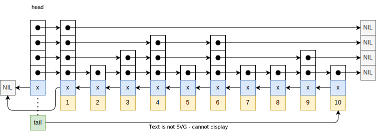
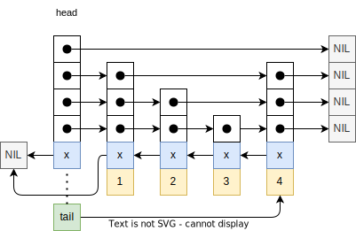

阅读代码：

 - 代码的复杂度：有些代码其背后是数学原理的体现，要彻底地理解代码，等价于彻底地理解数学的原理。原理可变，代码也可变，复杂的数量很多，也是困难的一个因素。

阅读分支：

- https://github.com/redis/redis/blob/7.4-rc1


## ch0 记录


概念的记录：

- 二：
  - 2.1：
    - 【Exported API，外部API】
    - 【Internal API，内部API】
- 四：
  - Internal function（内部函数，不暴露在头文件）


## 一、commands.c

This file is auto generated by utils/generate-command-code.py, the content is based on the JSON files in the src/commands folder. These are meant to be the single source of truth about the Redis commands, and all the metadata about them. These JSON files are not meant to be used by anyone directly, instead that metadata can be obtained via the COMMAND command.


### 1、generate-command-code.py

依赖系统模块【glob --- Unix style pathname pattern expansion（unix风格路径模式展开符）】

main

 - 在当前py脚本下，找到代码仓库的src目录的绝对路径：通过`__file__`，结合abspath与dirname，获取当前文件所在的目录，通过项目的目录结构拼接`/../src`得到。
 - 遍历 src/commands目录下的json文件。
   - 加载json文件（设计格式：一个命令key+属性）
   - 如果属性中包含container，说明是一个子命令。
   - 构造command对象：【。。。】
 - 打开src/cmmand.def文件：
   - 按照固定格式，模板，遍历所有命令，写入到文件中。
   - 【。。。】
 - 【END】

## 二、Radix树

### 2.1 结构体的定义

raxNode：

 - 32bit图：
   - iskey：本节点是否包含key（见最后一个字段）
   - isnull：关联的值是NULL（NULL表示：在data布局的格式中，值不是直接放在头部，而是在尾部的指针所指向的地方；）
   - iscompr：节点是被压缩的
   - size：如果是未压缩的节点，表示的是子节点的个数;如果是压缩的节点，表示压缩的字符串长度。
 - data：柔性数组，布局具体的内容。
   - 未压缩的：比如子节点个数为3，abc分别为3个节点的值，后面是3个节点的指针（格式：`[abc][a-ptr][b-ptr][c-ptr](value-ptr?)`）
   - 压缩的：（格式：`[xyz][z-ptr](value-ptr?)`）
   - value-ptr： 如果包含key 并且 值不为NULL，则存在。


rax：rax树结构体

 - *head：指向起始的rax节点。
 - numele： number element（元素个数？）
 - numnodes： 记录节点的个数
 - metadata：【柔性数组，？？？】

raxStack：栈数据结构，用于可选地返回调用者的一个父亲节点列表；rax节点出于空间占用考虑而没有“父亲”这个字段。所以我们在需要的时候，使用这个辅助的栈。

 - stacks：【二级指针】（，指向本结构体的static_items字段或者一个堆上分配的数组）Points to static_items or an heap allocated array.
 - items: 记录包含的个数（作用：游标，指向栈顶）
 - maxitems： 总空间的个数
 - static_items[32]（宏：RAX_STACK_STATIC_ITEMS）：避免在堆上进行分配，使用这个静态数组指针作为代替。
 - oom: 【？？？，这个是什么现象】True if pushing into this stack failed for OOM at some point.

rax节点回调函数：

 - 用于迭代器的可选项回调函数，在每个rax节点上被通知，保护不表示keys的节点。如果回调返回true，则回调改变了迭代器结构体的node字段指针（，？？？）且迭代器的实现将会替换radix树内部的指针。这个允许回调去重分配节点而执行非常特殊的操作。（？？？，什么操作？），常规的应用通常是不需要的。
 - 用于对radix树结构体执行非常低层级分析，扫描每个可能的节点（除了根节点），或为了重分配节点而减少**分配碎片化（allocation fragmentation）** （？：如何观测）。。。
 - 当前只支持前向迭代。。

```c
/* Optional callback used for iterators and be notified on each rax node,
 * including nodes not representing keys. If the callback returns true
 * the callback changed the node pointer in the iterator structure, and the
 * iterator implementation will have to replace the pointer in the radix tree
 * internals. This allows the callback to reallocate the node to perform
 * very special operations, normally not needed by normal applications.
 *
 * This callback is used to perform very low level analysis of the radix tree
 * structure, scanning each possible node (but the root node), or in order to
 * reallocate the nodes to reduce the allocation fragmentation (this is the
 * Redis application for this callback).
 *
 * This is currently only supported in forward iterations (raxNext) */
typedef int (*raxNodeCallback)(raxNode **noderef);
```

raxIterator：rax树的迭代器

 - flags：通过bit位来标记迭代器的当前状态
   - `RAX_ITER_JUST_SEEKED`：Iterator was just seeked. Return current element for the first iteration and clear the flag.
   - `RAX_ITER_EOF`：（到达迭代的终点）End of iteration reached.
   - `RAX_ITER_SAFE`：Safe iterator, allows operations while iterating. But it is slower.
 - rt：（，指向进行迭代的Radix树）Radix tree we are iterating.
 - key： 【？？？】The current string.
   - 注：如歌key的长度小于128，则放在当前的结构体内部。否则，在堆上按照2被大小扩张。
 - data： 【？？？】Data associated to this key.
 - key_len：（，当前key的长度）Current key length.
 - key_max：（，当前的key缓冲区可以持有的最大key长度）Max key len the current key buffer can hold. 
 -  key_static_string[128（宏：`RAX_ITER_STATIC_LEN`）]：  key buffer
 - node：（？？？）Current node. Only for unsafe iteration.
 - stack：（，rax栈，用于不安全的迭代；？？什么是不安全的？）Stack used for unsafe iteration.
 - node_cb：（，函数指针，可选项的节点回调函数；）Optional node callback. Normally set to NULL.

【Exported API，外部API】

 - 命名规范：统一以 raxXXX的格式。

【Internal API，内部API】

 - （，可能会被节点的回调使用，为了以**低层级的方式**访问rax节点；所以这个函数也被暴露。）May be used by the node callback in order to access rax nodes in a low level way, so this function is exported as well.


### 2.2 rax内存分配器

需要改代码，来改分配器。
rax_malloc.h

 - Allocator selection.（分配器选择）
 - （，为了在编译时改变Rax分配器。。。。）This file is used in order to change the Rax allocator at compile time. Just define the following defines to what you want to use. Also add the include of your alternate allocator if needed (not needed in order to use the default libc allocator).

```c
#define rax_malloc zmalloc
#define rax_realloc zrealloc
#define rax_free zfree
```

### 2.3 （❌）radix树实现

raxStackPush：

 - 如果项的个数 等于 最大个数，说明已经满了，需要扩大空间。
   - 如果栈指向静态数组字段
     - malloc分配2倍大小的空间
     - 将分配的地址设置到stack字段
     - 如果分配失败，恢复，设置oom，errno，返ERR
   - 否则，栈指向堆空间
     - 按照原大小的2倍，realloc
     - 如果分配失败，同上。
     - 设置新地址到栈字段
   - 最大个数字段设置为原来的2倍。
 - 在栈顶插入新的项，更新栈顶指针（个数）返OK

```
raxStackPush
 Ds: 将项入栈
 ret:
  1: 成功
  0: OOM 失败

```

#### 1、分配rax节点

raxPadding: 对于字符小节大小为nodeSize，为了使后面存放子节点的指针是在对齐地址上的（aligned address）。注意：+4，是因为结构体头部是4字节的。

```c
/* Return the padding needed in the characters section of a node having size
 * 'nodesize'. The padding is needed to store the child pointers to aligned
 * addresses. Note that we add 4 to the node size because the node has a four
 * bytes header. */
#define raxPadding(nodesize) ((sizeof(void*)-(((nodesize)+4) % sizeof(void*))) & (sizeof(void*)-1))
```

离散周期函数：通过wolframalpha画图，可以直观地看到。

```
discrete plot BitAnd[8 - Mod[(x+4), 8], 8-1] from x=0 to x=25

```

等价形式：

```
discrete plot BitAnd[Mod[8-(x+4), 8], 8-1] from x=0 to x=25
discrete plot BitAnd[Mod[z-(x+4), z], z-1] for z=4 or 8 from x=0 to x=25

Mod[z-(x+4), z]
```

由此可得其等价形式是：

```c
#define raxPadding(nodesize) ((sizeof(void*) - (nodesize+4)) % sizeof(void*))
```

#### 1、工具宏

raxNodeCurrentLength：返回radix节点的真实大小（支持压缩、非压缩）

 - 计算格式：`[header iscompr=0][abc][a-ptr][b-ptr][c-ptr](value-ptr?)`

raxNodeLastChildPtr：返回radix节点指向的最后一个子节点指针的二级指针

 - 公式 = node地址 + node真实大小 - value-ptr大小（如果存在） - node指针大小

raxNodeFirstChildPtr：指向radix节点指向的第一个


---

node auxiliary data：

 - 问题：value-ptr的大小是`void *`，但是在getData、setData中，需要将其强转为 `void**` ？？？
 - 自答： 要理解这个操作，先思考下 `n->i = 10`，这种结构体指针赋值操作。其具体是如何实现的呢？（猜测：本质上是取得字段的内存地址，再memcpy设置内存完成。）而在这里，由于柔性数组的子字段是一个`void *`,memcpy需要通过data的指针完成。由此转为二级指针

#### 2、添加子节点

raxAddChild

 - 计算旧节点与新节点的总长度。
 - 分配一个rax树子节点，失败返NULL
 - 根据新长度对n进行realloc
 - 遍历字符区，按照字母表顺序查找插入位置pos(在下面内存移动是第一个移动的位置)。
 - 如果存在auxiliary data pointer，将其移动到新节点的最后
 - 计算shift偏移（新旧长度之差 - 单个指针指针长度）
   - 如果可以使用已有的padding，则shift为0，否则需要新增则为1。
 - 1、通过memmove将pos之后的指针段，向后移动到辅助之前。
 - 2、如果需要shift：找到第一个子节点指针的位置，将其后的pos个位置向后移动shift长度。
 - 3、移动字符区域，从pos开始向后移动1个byte
 - 赋值，设置输出参数，返回新的n
 - 例子：以32位机器/4字节
   - 内存结构：`[HDR*][abde][Aptr][Bptr][Dptr][Eptr]|AUXP|`，新增字母c的子节点
   - realloc之后的结构： `[HDR*][abde][Aptr][Bptr][Dptr][Eptr]|AUXP|[....][....]`
   - 移动辅助数据指针：`[HDR*][abde][Aptr][Bptr][Dptr][Eptr][....][....]|AUXP|`
   - 第一次偏移：`[HDR*][abde][Aptr][Bptr][....][....][Dptr][Eptr]|AUXP|`
   - 第二次偏移：`[HDR*][abde][....][Aptr][Bptr][....][Dptr][Eptr]|AUXP|`
   - 第3次偏移： `[HDR*][ab.d][e...][Aptr][Bptr][....][Dptr][Eptr]|AUXP|`
   - 设置插入的值：`[HDR*][abcd][e...][Aptr][Bptr][Cptr][Dptr][Eptr]|AUXP|`

```
raxAddChild:
  Ds: 向一个节点添加子节点
  Para：
   n: 父节点，在其上面新增子节点
   c：表示子节点的字符
   childptr：【out】二级指针，将新分配的子节点的地址，修改参数（一级指针）值。
   parentlink：【out】三级指针，在父节点的数据段的存放子节点指针的位置（指针），修改参数（二级指针）值
  Ret: 新的父节点指针（可能进行realloc，重新分配）
   NULL：OOM，分配失败
```

---

raxCompressNode

 - 分配一个空内容的子节点
 - 计算压缩后的节点长度 = 头部 + 字符串 + 对齐 + 单个子节点指针
 - realloc
 - 设置节点的类型为已压缩。
 - 设置节点的各个属性（。。。）

```
raxCompressNode:
  Ds: 对一个未压缩的节点（不能存在子节点）进行压缩处理。使得树的某个分钟，连续多个表示单字符的子节点，被压缩成表示一个字符串的单节点。
  Para:
   n：被压缩的节点
   s：字符串指针，压缩后需要表示的字符串
   len：字符串长度
   child：【out】二级指针，新分配的，改参。
  Ret: 新的父节点指针（可能进行realloc，重新分配）
```

#### 3、raxLowWalk

raxLowWalk

 - 从头部节点开始
 - i 记录字符串遍历的位置
 - j 记录节点中子节点的位置
 - while 当前节点的大小不为0 且 字符串未遍历完
   - 如果当前节点是压缩的：
     - 双下标前进，循环遍历压缩节点的字符节，如果2者字符不等，break退出
     - 如果字符节的下标，没有遍历到终点。break退出（说明：匹配的字符过短而结束，或匹配终止）
   - 否则，从字符区进行线性搜索（linear search）查找子节点与下标字符相等的。
     - 如果 j 等于 子节点个数说明未搜索到。break退出（说明：无法匹配）
   - radix栈记录当前节点
   - 更新当前节点为对应的子节点（压缩节点只有1个）
   - 重置 j 下标为 0 （If the new node is non compressed and we do not iterate again (since i == len) set the split position to 0 to signal this node represents the searched key.）
   - 略
   - 返回下标 i，表示匹配的长度

```
raxLowWalk:
  Ds: 遍历一个radix树，
   type: [low level function] 低层级函数
  Para:
   rax：。。。
   s：匹配的字符串
   len：字符串长度
   stopnode：【out、nullable】匹配终止的radix节点
   plink：三维指针【out、nullable】对于终止节点其父节点的指针区执行其的二维指针地址
   splitpos：【out、nullable】如果终止节点是一个压缩节点，且字符匹配在其上面不是节点完全匹配，而是其中一部分，需要记录这一部分的下标；（例子：0，表示无需压缩节点的字符，其它则需要一部分，最大值是字符节的长度）
      用途：在插入时，对于终止节点可能出现分裂的情况，需要替换为新的节点。而需要修正父节点对于子节点的引用，将这里设置为新的子节点。
   ts：【out、nullable】radix栈，记录匹配字符串经过的radix栈
  Ret:

```

#### 4、插入节点

raxGenericInsert

- 调用 raxLowWalk，对插入的元素的进行匹配。
- 如果：匹配的长度等于插入的长度 且 不在一个压缩节点的中间位置。
  - 如果终止节点不包含key  或 （关联值为NULL 且 覆盖）：
    - 【？？？】说明不存在关联值的指针空间，对节点realloc，并设置数据指针。
      - OOM，返0
    - 根据walk遍历返回的父节点data存放位置，更新为新的节点指针。
  - 如果本节点存在key，更新之：
    - 存放旧的
    - 如果覆盖，设置新的。
    - 返 0
  - 将节点设置为存在key，设置数据指针。
  - radix树元素个数 ++
  - 返1
- （注释：如果节点终止在一个压缩节点上，我们继续进行下去前，需要将这个节点**分裂**）
  - （，分裂一个压缩节点有着一些可能的情况。）Splitting a compressed node have a few possible cases.
  - 例子：假设h是一个压缩节点，包含字符串 "ANNIBALE"。这个节点指向另一个压缩节点。
    - `"ANNIBALE" -> "SCO" -> []`
    - 1、插入 "ANNIENTARE"
    - 2、插入 "ANNIBALI"
    - 3、插入 "AGO"（原节点被设置为
    - 4、插入 "CIAO"
    - 5、插入 "ANNI"

1、压缩节点被分裂为2个压缩节点 + 1个非压缩

```
               |B| -> "ALE" -> "SCO" -> []
     "ANNI" -> |-|
               |E| -> (... continue algo ...) "NTARE" -> []

```

2、压缩节点被分裂为1个压缩节点 + 1个非压缩

```
                  |E| -> "SCO" -> []
     "ANNIBAL" -> |-|
                  |I| -> (... continue algo ...) []
```

3、压缩节点被分裂为2个非压缩节点 + 1个压缩

```
            |N| -> "NIBALE" -> "SCO" -> []
     |A| -> |-|
            |G| -> (... continue algo ...) |O| -> []
```

4、压缩节点被分裂为1个非压缩节点 + 1个压缩

```
     |A| -> "NNIBALE" -> "SCO" -> []
     |-|
     |C| -> (... continue algo ...) "IAO" -> []
```

5、压缩节点被分类为2个压缩节点

```
     "ANNI" -> "BALE" -> "SCO" -> []
```

- 注释：ALGORITHM 1
  - （，例子1到4，所有例子下由于字符不匹配而停止于一个压缩节点的中间）For the above cases 1 to 4, that is, all cases where we stopped in the middle of a compressed node for a character mismatch, do:
  - Let `$SPLITPOS` be the zero-based index at which, in the compressed node array of characters, we found the mismatching character. For example if the node contains "ANNIBALE" and we add"ANNIENTARE" the `$SPLITPOS` is 4, that is, the index at which the mismatching character is found.
  - 1、（，保存当前压缩节点的子节点指针；）Save the current compressed node `$NEXT` pointer (the pointer to the child element, that is always present in compressed nodes).  
  - 2、（，创建“分裂节点” ？？？ 。。。） Create "split node" having as child the non common letter at the compressed node. The other non common letter (at the key) will be added later as we continue the normal insertion algorithm at step "6".  
  - 3a. IF `$SPLITPOS` == 0:  （，说明压缩节点的第一个字符就不匹配）
    - （，使用分裂节点替换旧的节点；。。。）Replace the old node with the split node, by copying the auxiliary data if any. Fix parent's reference. Free old node eventually (we still need its data for the next steps of the algorithm).  
  - 3b. IF `$SPLITPOS` != 0: 
    - （，裁剪压缩节点（重分配之）而使其包含spos个字符；并改变其子节点指针而链到分裂节点上；如果新的压缩节点长度为1，设置其属性为非压缩；。。。）Trim the compressed node (reallocating it as well) in order to contain `$splitpos` characters. Change child pointer in order to link to the split node. If new compressed node len is just 1, set iscompr to 0 (layout is the same). Fix parent's reference.
  - 4a. （，如果后缀长度不为0（，就是压缩节点其**分裂字符**之后的剩余字符），则创建一个“后缀节点”。。。其子节点指针指向next指针；）IF the postfix len (the length of the remaining string of the original compressed node after the **split character**) is non zero, create a "postfix node". If the postfix node has just one character set iscompr to 0, otherwise iscompr to 1. Set the postfix node child pointer to `$NEXT`.  
  - 4b. （，如果后缀长度为0，使用next指针作为后缀指针）IF the postfix len is zero, just use `$NEXT`as postfix pointer.  
  - 5、（，分裂节点的第一个子节点是后缀节点）Set child[0] of split node to postfix node.  
  - 6、（，将分裂节点设置为当前节点，设置当前下标为第二个字节点，并继续插入算法；）Set the split node as the current node, set current index at child[1] and continue insertion algorithm as usually.
- 注释：ALGORITHM 2
  - For case 5, that is, if we stopped in the middle of a compressed node but no mismatch was found, do: 
  - Let `$SPLITPOS` be the zero-based index at which, in the compressed node array of characters, we stopped iterating because there were no more keys character to match. So in the example of the node "ANNIBALE", adding the string "ANNI", the `$SPLITPOS` is 4.  
  - 1、Save the current compressed node `$NEXT `pointer (the pointer to the child element, that is always present in compressed nodes).  
  - 2、Create a "postfix node" containing all the characters from `$SPLITPOS` to the end. Use `$NEXT` as the postfix node child pointer. If the postfix node length is 1, set iscompr to 0. Set the node as a key with the associated value of the new inserted key.  
  - 3、Trim the current node to contain the first `$SPLITPOS` characters. As usually if the new node length is just 1, set iscompr to 0. Take the iskey / associated value as it was in the original node. Fix the parent's reference.  
  - 4、Set the postfix node as the only child pointer of the trimmed node created at step 1.
- IF 终止节点是压缩的，并且匹配的长度不为插入元素长度：
  - 。。。
  - 步骤完成，释放终止节点的内存。分裂节点成为终止节点。
- ELIF 终止节点是压缩的，并且匹配的长度等于插入元素长度：
  - 。。。
- （，目前位置走到最远处，但是任然有剩余的字符。我们需要插入缺失的节点）We walked the radix tree as far as we could, but still there are left chars in our string. We need to insert the missing nodes.
  - 。。。
- 插入结束，终止节点进行realloc，为了能存放 （参数：新的数据指针）
- 如果不包含key，radix数的元素的统计数据++ （？？？ 什么意思）
  - 自答：就是原有节点，如果不包含key，这次插入了key，所以统计更新。
- 修复parent数据指针为当前。
- 返 1（表示元素插入）
- OOM：
  - 。。。


```
raxGenericInsert
  Ds: 通用的插入方法
  Para:
   rax：
     【out】：更新统计数据
   s： 插入的元素（字符串）
   len：插入字符串的长度
   data： 新的数据指针。
   old：【out，nullable】二维指针，用于存放旧的数据指针。
   overwrite： 如果元素已经存在，参数值为1，则关联的数据被给定参数更新
  Ret:
   0: 存在且覆盖返0；
    errno：【global】，如果出现oom，设置为 ENOMEM
   1：元素插入（Element inserted.）

```

##### 4.1 接口-包装器

- raxInsert：同上，覆盖参数为1，插入强制更新
- raxTryInsert：同上，覆盖参数为0，不更新

#### 5、查找类


#### 6、删除

##### raxRemoveChild：

- 注释：If parent is a compressed node (having a single child, as for definition of the data structure), the removal of the child consists into turning it into a normal node without children.
- 如果父节点是压缩节点：
  - 只是把节点的属性设置为为非压缩，大小设置为0。
  - 如果存在key，则取其value。
  - 注意：改为非压缩节点的过程，占用内存减少，不会进行realloc。而是通过memcpy向前移动，剩余空间不使用。
  - 如果存在key，重新设置value（这个过程会计算大小，memcpy）
  - 返回父节点。
- 注释：（否则我们需要扫描出子节点的位置，对应地进行memmove）Otherwise we need to scan for the child pointer and memmove() accordingly.
- 1、To start we seek the first element in both the children pointers and **edge bytes** in the node.
  - 移动到第一个子节点和首个字符
- 2、Search the child pointer to remove inside the array of children pointers.
  - while 1：
    - memcpy第一个节点与（参数：节点）
    - 如果相同break
    - 否则，指针++，字符指针++。
- 3、（，移动字符节的位置，因为删除了一个字节；）Remove the edge and the pointer by memmoving the remaining children pointer and edge bytes one position before.
- （，计算偏移量）Compute the shift, that is the amount of bytes we should move our child pointers to the left, <u>since the removal of one edge character and the corresponding padding change, may change the layout.</u> We just check if in the old version of the node there was at the end just a single byte and all padding: in that case removing one char will remove a whole sizeof(void*) word.
  - `size_t shift = ((parent->size+4) % sizeof(void*)) == 1 ? sizeof(void*) : 0;`
  - 如果头部大小 + 字符数 的大小对于指针大小取余是1，则说明减去这个字符的，实际上要减少8个bit位。
- 如果存在对齐偏移：
  - Move the children pointers before the deletion point.
- Move the remaining "tail" pointers at the right position as well.
  - 【？？？】为什么不是2个一起移动，而要分开移动？
  - 自答：代码没有仔细看，实际上这里就是2个一起移动。上一步是为了处理对齐变化的偏移。
- 更父节点的大小 - 1
- （，重分配节点的大小，可以释放多占用的内存）realloc the node according to the theoretical memory usage, to free data if we are over-allocating right now.
  - 如果realloc失败（返NULL），返回旧的父节点即可。

```
raxRemoveChild：
  Ds：移除父节点上的子节点
    type: [low level function] 低层级函数
    Note：不会因为OOM而失败
  Caller：
    （，不会修复父节点在其父亲上的引用位置）Note that this function does not fix the pointer of the parent node in its parent, so this task is up to the caller. 
  Para：
    parent：父节点
    child：被删除的子节点
       Convention: 如果父节点是非压缩节点，则参数child，必须存在于父节点。否则进入死循环
  Ret: raidx节点指针
    1、新的父节点（如果子节点删除了）
    2、原节点（未删除）
```

##### raxRemove：

- 。。。
  - 如果walk查找出现（3种情况：1、长度不匹配 2、压缩却不在起始之前  3、不包含key），则直接返回0；
- 注释：If this node has no children, the deletion needs to reclaim the no longer used nodes. This is an iterative process that needs to walk the three upward, deleting all the nodes with just one child that are not keys, until the head of the rax is reached or the first node with more than one child is found.
- 如果终止节点没有子节点：
  - while 终止节点不是radix树头部：
    - 释放节点内存
    - radix栈，出栈，终止节点更新
    - If this node has more then one child, or actually holds a key, stop here.（break退出）
  - 如果child节点不为null
    - 需要将已删除的child，在其父节点上去除引用。
    - （函数：raxRemoveChild）移除
    - 如果父节点被realloc了：
      - 需要修改父父节点的引用
      - peek radix栈，获取父父节点。
      - 如果为NULL：
        - 说明需要更新radix树的head指针
      - 否则：需要find（查找）具体位置
      - 通过memcpy将新的位置复制过去。
    - If after the removal the node has just a single child and is not a key, we need to try to compress it.
- 如果终止节点有一个子节点：
  - （，如果这个节点只有一个子节点，则有可能在移除这个节点的key后，进一步与相邻的节点压缩在一起；）If the node had just one child, after the removal of the key further compression with adjacent nodes is potentially possible.
- （，异常场景：。。。）Don't try node compression if our nodes pointers stack is not complete because of OOM while executing `raxLowWalk()`
- 注释：重压缩
  - Recompression: if trycompress is true, 'h' points to a radix tree node that changed in a way that could allow to compress nodes in this sub-branch. Compressed nodes represent chains of nodes that are not keys and have a single child, so there are two deletion events that may alter the tree so that further compression is needed:  
  - 1、A node with a single child was a key and now no longer is a key. 
  - 2、A node with two children now has just one child.  
  - （，尝试向上引导直到有其它节点可以被压缩；当我们到了一个上部节点其不是一个key且有一个单个子节点，我们扫描子节点链而搜集树的可压缩部分，并替换当前节点为新的，。。。）We try to navigate upward till there are other nodes that can be compressed, when we reach the upper node which is not a key and has a single child, we scan the chain of children to collect the compressible part of the tree, and replace the current node with the new one, fixing the child pointer to reference the first non compressible node.
- 【🤢🤢🤢】
- 返 1；

例子1：

```
Example of case "1". A tree stores the keys "FOO" = 1 and "FOOBAR" = 2:

"FOO" -> "BAR" -> [] (2)
          (1)
          
After the removal of "FOO" the tree can be compressed as:

"FOOBAR" -> [] (2)
```

例子2：

```
Example of case "2". A tree stores the keys "FOOBAR" = 1 and "FOOTER" = 2:

         |B| -> "AR" -> [] (1)
"FOO" -> |-|
         |T| -> "ER" -> [] (2)

After the removal of "FOOTER" the resulting tree is:

"FOO" -> |B| -> "AR" -> [] (1)

That can be compressed into:

"FOOBAR" -> [] (1)
```

===

```
raxRemove：
	Ds：删除指定的字符项
	Para：
	  rax：。。
	  s：删除的字符项
	  len：字符长度
	  old：【out，nullable】删除的数据
	Ret：
		1：字符项被发现，并且删除成功
		0：否则，返回0
```


#### 7、内存释放


raxRecursiveFree：

-  （，执行对一个树的深度优先，递归释放子节点的内存；）performs a depth-first scan of the tree and releases all the nodes found.
  - （参数：free_callback），如果节点存在key，则通过回调释放value；

raxFree：

- （，释放整个radix树，注意，其没有回调不释放辅助数据；）Free a whole radix tree.


#### 8、（❌）迭代器（Iterator）

##### raxIteratorNextStep：

- 注释：
  - Do an iteration step towards the next element. At the end of the step the iterator key will represent the (new) current key. If it is not possible to step in the specified direction since there are no longer elements, the iterator is flagged with `RAX_ITER_EOF`.  
  - If 'noup' is true the function starts directly scanning for the next lexicographically smaller children, and the current node is already assumed to be the parent of the last key node, so the first operation to go back to the parent will be skipped. This option is used by raxSeek() when implementing seeking a non existing element with the ">" or "<" options: the starting node is not a key in that particular case, so we start the scan from a node that does not represent the key set.

```
raxIteratorNextStep：
  Ds：安装字母表顺序，将迭代器移动到下一个元素位置。
  Para:
    it： 迭代器
    noup：
  Ret：
  	1：成功
  	0：OOM
```


##### raxSeekGreatest

```
raxSeekGreatest：
  Ds：（移动到迭代器当前节点的子树的最大的key）Seek the greatest key in the subtree at the current node.
  Para:
    it: 迭代器
  Ret：
  	0：OOM
  	1：其它情况
```

##### raxIteratorPrevStep

```
raxIteratorPrevStep：
	Ds：安装字母表顺序，将迭代器移动到上一个元素位置。
```


##### raxSeek

- 重置it里的栈的游标位置为0，迭代器标准清理EOF，并设置为JUST；。。。
- 由操作符而设置标志位，用于执行seek
- 如果radix树的元素个数为0 ：
  - If there are no elements, set the EOF condition immediately and return
  - 返 1
- 。。。

```
raxSeek：
	Ds：Seek an iterator at the specified element.
	Para：
	  it：迭代器
	  op：操作符，类型有： '>', '>=', '<', '<=', '=', '^', '$'
	  ele：
	  len：
    Ret：
      0：
        OOM：设置errno
        Syntax error
      1： others
```


#### 9、（❌）自检（Introspection）

## 三、Dict

### 3.1 结构体

#### 1、字典类型

dictType：

- 回调函数（指针）：Callbacks
  - 哈希函数指针：` uint64_t (*hashFunction)(const void *key);`
  - 【🤢🤢🤢】
  - dictMetadataBytes：返回字典额外元数据的大小（创建API，会置0）
- 数据：Data
  - userdata：指针-指向用户数据。
- 标志位：Flags
  - no_value：The 'no_value' flag, if set, indicates that values are not used, i.e. the dict is a set. When this flag is set, it's not possible to access the value of a dictEntry and it's also impossible to use dictSetKey(). Entry metadata can also not be used.
  - keys_are_odd：。。。
- 可支持特性（feature）：默认设置NULL
  - 【🤢🤢🤢】
- 可选回调函数：Optional callback
  - 【🤢🤢🤢】


#### 2、字典项

dictEntry：

- key：key指针
- v：value联合体，可以存放指针，64位整数，或浮点数
  - val：指针
  - u64、s64
  - d
- next：（，在相同哈希桶之下的下一项）Next entry in the same hash bucket.

dictEntryNoValue：同上，但是没有value；

#### 3、字典

dict：

- type：字典类型
- `ht_table[2]`：项的二维指针
- ht_used[2]：。。。
- rehashidx：（，标志）rehashing not in progress if rehashidx == -1
- 。。。
- `ht_size_exp[2]`：（，hasb表大小的幂）exponent of size. (`size = 1<<exp`)
- pauseAutoResize：
  - If >0 automatic resizing is disallowed
  - 0：allow
  - <0 indicates coding error
- metadata：柔性数组

#### 4、迭代器

dictIterator：

- // If safe is set to 1 this is a safe iterator, that means, you can call dictAdd, dictFind, and other functions against the dictionary even while iterating. Otherwise it is a non safe iterator, and only dictNext() should be called while iterating.\
- d：字典
- index：当前下标
- table：
- safe：
  - 1：安全
  - 其它：不安全
- entry：
- nextEntry：
- fingerprint：unsafe iterator fingerprint for misuse detection.


### 3.2 API


```
dictCreate：
  Ds：创建一个新的hash表
  Para：
    type： 创建的字典类型
  Ret：字典对象
     额外数据置0
     reset 哈希表参数
     初始化结构体
```


```
dictTypeAddMeta：
   Ds：Change dictType of dict to another one with metadata support Rest of dictType's values must stay the same
   Para：
     d：字典二维指针
      out： 
       字典对象被realloc
       设置新的字典类型
      约束： 旧的字典没有元数据
     typeWithMeta：
       assert：与旧的类型，除元数据大小函数，和字典释放上，必须memcmp一致
   Ret：void
```


## 四、跳表（zskiplist）


zskiplistNode：

- ele：
- score：
- backward：反向指针
  - 头部节点指向NULL

- `level[]` ：柔性数组，表示具有层级。
  - forward：前向指针
  - span：前向指针所指向的元素与当前之间的跨度。


zskiplist：

- header：指向跳表的头部
  - 注：头部是一个特殊节点，不存放具体数据，初始化跳表就存在。

- tail：指向跳表的尾部
- length：记录跳表节点个数。
- level：记录的是head头部的level分配的个数吗？




### 4.1 宏与工具

`ZSKIPLIST_MAXLEVEL`（32）：跳表能支持的最大层级，Should be enough for 2^64 elements

`ZSKIPLIST_P`（0.25）：跳表概率，Skiplist P = 1/4

zslRandomLevel

- Returns a random level for the new skiplist node we are going to create. The return value of this function is between 1 and `ZSKIPLIST_MAXLEVEL` (both inclusive), with a powerlaw-alike distribution where higher levels are less likely to be returned.
- while  rand  <  概率 x  随机最大值时：
  - level++
- 返回 level（进行最大值限制）

```
zslRandomLevel：
   Ret：
     1~32： 根据幂律的概率分布返回，高层级的概率低。
```

### 4.2 创建

zslCreate

- 创建跳表对象
- 层级设置为1
- 长度为0
- 创建头部节点（按最大层级）
- 遍历最大层级：
  - 层级的前向指针为NULL，跨度为0
- 头部的后向指针为NULL
- 尾部为NULL


### 4.3 插入



zslInsert：

- 创建（局部数组（按最大层级）：更新节点数组），由于新的节点插入，插入位置的前后节点的引用位置都需要更新。
  - 注：这个是按照**小的（插入点的左边）**一个记录的
- 创建（局部数组（按最大层级）：更新跨度数组）
  - 注：**这个是头部到层级更新节点，二者之间的累积跨度**。
- 从跳表的头部节点开始。
- 遍历：从跳表最大层级开始往下
  - store rank that is crossed to reach the insert position 
    - （？？？ 更新跨度数组没有进行初始化，为什么引用后一个的值）
      - 自答：因为下标是减小的，引用后一个表示上一轮更新的值。
    - ？ 为了要加上一轮的值呢？
      - 自答：因为更新节点会前进，而记录的是从头部到当前的累积跨度。
  - while 下一跳不为NULL，且（下一跳的分数小于 插入的；或者 ； 分数同而字符小）
    - Note：跳表是一个有序链表，要确定插入位置。
    - 当前下标的跨度   加上   当前节点的所在层级的跨度
    - 当前节点更新为下一跳
  - 更新节点数组记录当前层级的更新节点为当前节点
- （，注意点：可以允许插入分数相同的元素，但是不可能发生（因为：调用者在外层会做检查。））we assume the element is not already inside, since we allow duplicated scores, reinserting the same element should never happen since the caller of zslInsert() should test in the hash table if the element is already inside or not.
- 返回新节点的随机层级
- 如果 随机层级  >  头部层级
  - 遍历： 大于头部的层级
    - （更新跨度数组）设置为0
    - （更新节点数组）设置为头部节点
    - 头部节点对应层级的跨度设置为跳表的长度。（？？？）
  - 跳表的层级更新为 随机层级
- 创建插入节点：分配内存。
- 遍历：随机层级
  - 新节点对应层级的前置指针 设置为 （更新节点数组）对应层级的前置指针
  - （更新节点数组）对应层级的前置指针 设置为  新节点
  - update span covered by `update[i]` as x is inserted here
    - 更新节点与新节点需要依据（更新跨度数组）设置。
    - ！！！： 仔细看一遍。
- （，场景：新节点的层级小，插入后，原有的高层级跨度需要更新）increment span for untouched levels
  - 遍历： 大于随机层级的头部层级
    - 对更新节点的层级跨度 ++
- 设置新节点的后向指针
  - 如果（更新节点数组）的第一个是头部，则说明插入的位置是第一个（不存在前面的节点），后向指针要设置为NULL
  - 否则，设置为 （更新节点数组）的第一个节点
- 如果新节点的第一层的前向指针不为NULL：
  - 则该前向的后向需要更新，为这个插入的节点
- 否则：说明这个节点插入的是尾部节点 
  - 跳表的尾部节点更新为新节点。
- 跳表长度++
- 返回 新节点

```
zslInsert：
   Ds：将一个包含给定 score 和 member 的新节点添加到跳表中
   Para：
     zsl：跳表
     score：插入节点的分数
     ele：插入节点字符串
   Ret：新节点
```


## 五、动态字符串（SDS）

**Simple dynamic strings**


sds类型：

- typedef：`char *`
- 注：sds实际指向，各种sds头部结构体的buf位置。


sdshdr8：

- len：8bit
- alloc：8bit，excluding the header and null terminator
- flags：3 lsb of type, 5 unused bits
- buf：柔性数组，实际分配的字符串内容。


### 5.0 参考文章

在 Redis 内部， 字符串的追加和长度计算很常见， 而 APPEND 和 STRLEN 更是这两种操作，在 Redis 命令中的直接映射， 这两个简单的操作不应该成为性能的瓶颈。

另外， Redis 除了处理 C 字符串之外， 还需要处理单纯的字节数组， 以及服务器协议等内容， 所以为了方便起见， Redis 的字符串表示还应该是**二进制安全的**： 程序不应对字符串里面保存的数据做任何假设， 数据可以是以 `\0` 结尾的 C 字符串， 也可以是单纯的字节数组， 或者其他格式的数据。

考虑到这两个原因， Redis 使用 sds 类型替换了 C 语言的默认字符串表示： sds 既可高效地实现追加和长度计算， 同时是二进制安全的。


### 5.1 工具宏

SDS_HDR：

- 目标：从给定大小（T）与 sds指针（s），s 减去 sds头部大小，而得到 sds头部指针的起始位置。

SDS_HDR_VAR：同上，但是分配了一个对应的局部变量存放。

```
#define SDS_HDR_VAR(T,s) struct sdshdr##T *sh = (void*)((s)-(sizeof(struct sdshdr##T)));
#define SDS_HDR(T,s) ((struct sdshdr##T *)((s)-(sizeof(struct sdshdr##T))))
```


## 六、SipHash


## 七、CRC

XMODEM CRC 16算法：

- 标准：CCITT standards

```
Name                       : "XMODEM", also known as "ZMODEM", "CRC-16/ACORN"
Width                      : 16 bit
Poly                       : 1021 (That is actually x^16 + x^12 + x^5 + 1)
Initialization             : 0000
Reflect Input byte         : False
Reflect Output CRC         : False
Xor constant to output CRC : 0000
Output for "123456789"     : 31C3
```


## 九、quicklist


## 十、压缩列表（ziplist）


## 十一、工具


## 十二、过期桶（EBUCKETS）


