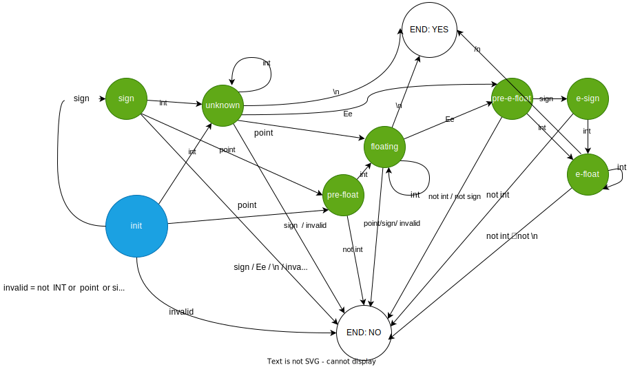

```
 100~2000, 1000~5000
    900  ~~  3000
  a1~a2, b1~b2
=======
  arr
  if a1 < b1:
    if a2 < b1:
       arr.push(a1 - 1)
       arr.push(a1)
       arr.push(a2 + 1)
       
       

```


### a、有限状态机

输入：+1.11e-11 ，有效




#### 1、实现1

```c
enum state {
    INIT,
    SIGN,
    UNKNOW,
    PRE_FLOAT,
    FLOATING,
    PRE_E_FLOAT,
    E_SIGN,
    E_FLOAT,
    END_NO,
    END_YES,
};

#define CHAR_IS_SIGN(s)  ((s) == '+' || (s) == '-')
#define CHAR_IS_POINT(s)  ((s) == '.')
#define CHAR_IS_E(s)  ((s) == 'e' || (s) == 'E')
#define CHAR_IS_INT(s)  ((s) <= '9' && (s) >= '0')
#define CHAR_IS_END(s)  ((s) == '\0')


int main()
{

    char buf[30];
    scanf("%s", buf);

    int len = strlen(buf);
    int i = 0;

    enum state e = INIT;
    while(i <= len) {
        char s = buf[i];
        if(e == END_NO || e == END_YES) {
            break;
        }

        switch (e) {
            case INIT:
                if(CHAR_IS_SIGN(s)) {
                    e = SIGN;
                }else if(CHAR_IS_INT(s)) {
                    e = UNKNOW;
                }else if(CHAR_IS_POINT(s)) {
                    e = PRE_FLOAT;
                }else {
                    e = END_NO;
                }
                break;
            case SIGN:
                if(CHAR_IS_INT(s)) {
                    e = UNKNOW;
                }else if(CHAR_IS_POINT(s)) {
                    e = PRE_FLOAT;
                }else {
                    e = END_NO;
                }
                break;
            case UNKNOW:
                if(CHAR_IS_INT(s)) {
                    e = UNKNOW;
                }else if(CHAR_IS_E(s)) {
                    e = PRE_E_FLOAT;
                }else if(CHAR_IS_END(s)) {
                    e = END_YES;
                }else if(CHAR_IS_POINT(s)) {
                    e = FLOATING;
                }else {
                    e = END_NO;
                }
                break;
            case PRE_FLOAT:
                if(CHAR_IS_INT(s)) {
                    e = FLOATING;
                }else {
                    e = END_NO;
                }
                break;
            case FLOATING:
                if(CHAR_IS_INT(s)) {
                    e = FLOATING;
                }else if(CHAR_IS_E(s)) {
                    e = PRE_E_FLOAT;
                }else if(CHAR_IS_END(s)) {
                    e = END_YES;
                }else {
                    e = END_NO;
                }
                break;
            case PRE_E_FLOAT:
                if(CHAR_IS_SIGN(s)) {
                    e = E_SIGN;
                }else if(CHAR_IS_INT(s)) {
                    e = E_FLOAT;
                }else {
                    e = END_NO;
                }
                break;
            case E_SIGN:
                if(CHAR_IS_INT(s)) {
                    e = E_FLOAT;
                }else {
                    e = END_NO;
                }
                break;
            case E_FLOAT:
                if(CHAR_IS_INT(s)) {
                    e = E_FLOAT;
                }else if(CHAR_IS_END(s)) {
                    e = END_YES;
                }else {
                    e = END_NO;
                }
                break;
        }
        i++;
    }
    
    if(e == END_YES) {
        printf("%d", 1);
    }else {
        printf("%d", 0);
    }
    
    return 0;
}


```

#### 2、改进点

使用二维表的形式

```
states(in) --(inputs_types)-->  states(out)
```

===

> Note：
>
> 这里的 数组初始化使用的是 GCC **Designated Initializers**

```c
enum {
    S1,
    S2,
    S_BUTT
};

enum {
    I1,
    I2,
    I_BUTT
};
int convert_table[S_BUTT][I_BUTT] = {
    [S1] = {
        [I1] = S1,
        [I2] = S2
    },
    [S2] = {
        [I1] = S1
    },
};
```


